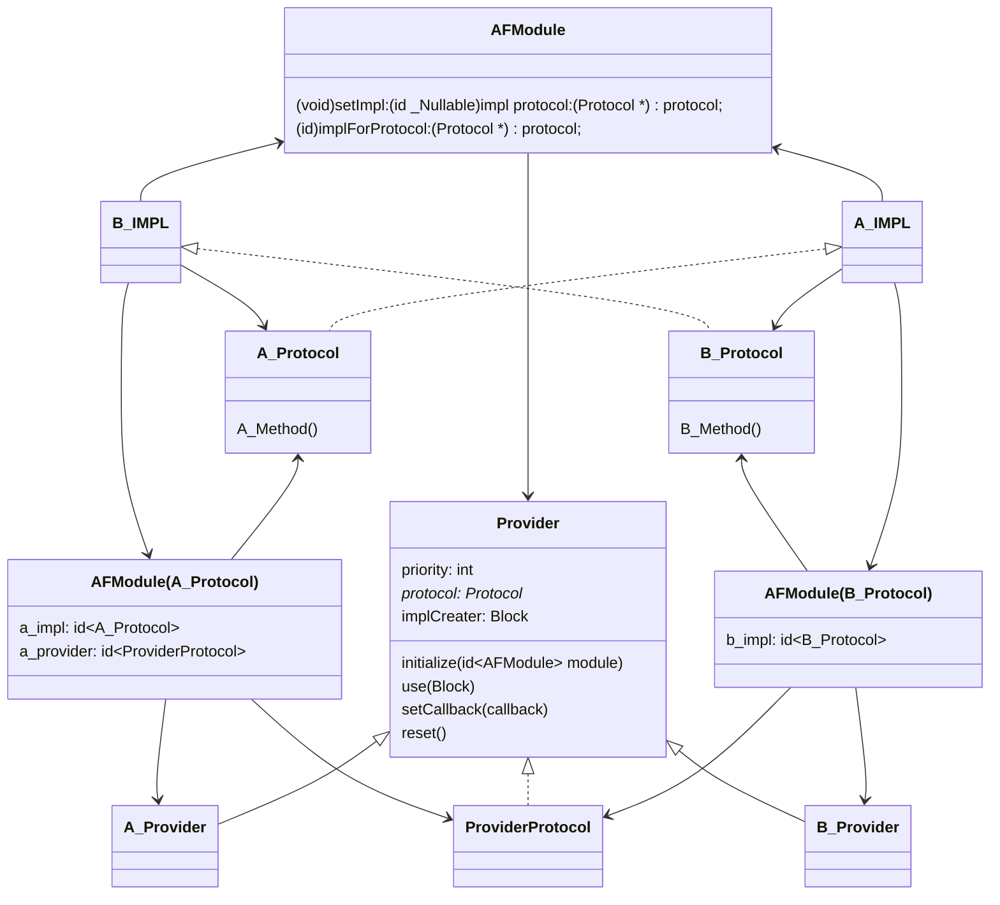

# AFModule

## Installation

AFModule is available through [CocoaPods](https://cocoapods.org). To install
it, simply add the following line to your Podfile:

```ruby
pod 'AFModule'
```

## Usage

This framework need three step:

1. Define Protocol
2. Implement Protocol
3. Register Protocol

### Define Protocol

When define you protocol, you are telling others the actions that your service can do. 

And, please let your Protocol inherit `AFModuleProtocolIndicator`.

What's more, also extension AFModule, so that others can get your service's impl.

```objective-c
@protocol AFProtocolA <AFModuleProtocolIndicator>
- (void)hello:(NSString *)name;
@end
  
DeclareProtocol(yourPropertyName, AFProtocolA) // importent!
```

### Implement Protocol

This step is a simple one, just let your class conform to your `Protocol`.

```objective-c
@interface AFObjA : NSObject<AFProtocolA>
@end
```


### Register Protocol

In this step, we are try to tell the AFModule all your infomation. Such as your service's priority, the initial action and more.

```objective-c
RegistProtocol(1, yourService, AFProtocolB, ^id(id<AFModule>  _Nonnull module) {
    return [AFObjA new];
})
```

The code above, is try to call a macro.

In this macro, you are provide some infomation to AFModule:

	1. The priority of your Services.
	1. The property name of AFModule that others can perform method on.
	1. Your Protocol.
	1. The initial action you want to do. In example, we simply return an implement of the Protocol.

### Other Useage

Sometimes your initial action do not return a impl, but do something else.

This framework take this in consideration. 

You can call `use:` later.

Notice: For safety, this framework will not let this action work right away.

```objective-c
RegistProtocol(1, yourService, AFProtocolB, ^id(id<AFModule>  _Nonnull module) {
    return nil;
})
  
[[AFModule shareInstance].yourService method:obj] // Nothing happend, because impl is nil.

// let impl exists!
[[AFModule shareInstance].yourServiceProvider use:^id(id<AFModule>  _Nonnull module) {
		return [AFObjB new];
}];
  
[[AFModule shareInstance].yourServiceProvider restCreater];
// or
[[AFModule shareInstance] reload];

[[AFModule shareInstance].yourService method:obj] // It works!
```

## How


See: [AFObjA.m](./Example/AFModule/Modules/ModuleA/AFObjA.m).

 This file shows not the the macro works.

## Author

AFutureD, afuture.d@outlook.com

## License

AFModule is available under the MIT license. See the LICENSE file for more info.

# 中文介绍

一个 iOS App 通常会依赖很多组件，比如 YYModel 和 Masonry。

当依赖的组件越来越多时，我们就会考虑对这些组件进行分层分组。比如按照层次，可以尝试分为基础组件、通用组件、业务组件等。每个层级内也可以进一步划分，比如网络库和本地IO库、首页页面库和设置页面库等。

上层的组件对下层的组件，我们允许代码层面得直接依赖，但是同一层组件有时候由于业务的需要也会有一些依赖关系。这些依赖关系是随着业务迭代产生的，而我们又很难消耗巨大的精力对组件进行重构，以解决依赖问题。

为了以较低的成本解决组件间依赖的问题，AFModule 尝试提供一个简单的框架满足组件间的相互调用。

组件间仅依赖对方的协议(Protocol)，只知道对方提供的行为。当前组件只能通过以一个中间者(AFModule) 拿到另一个组件对应的实现(impl)。

这样我们在代码层面上去除了组件的耦合。

为了方便其他组件使用，我们可以通过 Extension 对 AFModule 进行属性扩展。

当然，对于 AFModule 我们还需要考虑几个问题：

1. 注册时机；
2. 生效时机；
3. 如何获取实现对象；
4. 同一个协议有多个实现者时需要考虑优先级。

上述要求，促使我们需要增加一个类 Provider 来完成上面的事情。当然，这个对象应当与上面提到的熟悉扩展一样，声明仅存在于 当前组件内。

简单的结构图：



## 使用

